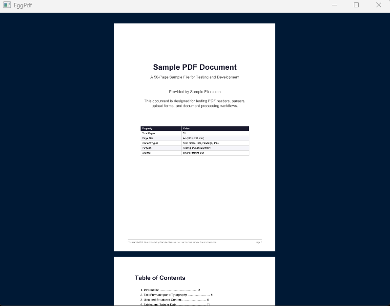

# EggPdf Viewer

A lightweight PDF viewer written using [OpenGL](https://www.opengl.org/) and [Apache PdfBox](https://pdfbox.apache.org/).

The goal of this project is to make a lightweight feature-rich and high-performance PDF viewer 
by taking advantage of GPU acceleration.

---

## Current Status

### Implemented
- Basic OpenGL setup
- Basic PDFBox setup
- Basic navigation (Scrolling, Zooming)
- Resizable window without affecting page aspect ratio
- Dynamic PDF loading through temporary AWT File Dialog
- Visible page loading (loaded pages are not erased from memory)
- LRU cache to stop the ram exploding

### Planned
- Look into unrendered pages fucking up rendering, maybe replace unrendered pages with a basic rectangle rather than showing any rendered page
- Tiling of pages to reduce rendering of pixels not in view (As in during zoom)
- Variable DPI of pages (Should be low during scrolling and pages in cache but outside view)
- A custom OpenGL-based UI
- Annotations, search, selection, any other basic features
- Multiple PDF support (via easy-to-use UI)
- Optimizations of the graphics pipeline

---

## Libraries

- LWJGL (OpenGL)
- Apache PDFBox

---

## Getting Started

### Requirements

- Java (17+)
- OpenGL compatible GPU
- Gradle or Maven

### Clone Repository

```bash
git clone <this-repo>
cd <project-name>
```

### Compile and Run

```bash
./gradlew run
```
### Usage
- Use W and S for scrolling the PDF.
- Use Up and Down arrow keys to zoom in and out.

---

## Screenshots



---

## Goals

This project exists mainly for:
- learning OpenGL rendering in Java
- an experiment in GPU-accelerated PDF rendering
- a lightweight alternative to UI-heavy PDF viewers

---

## Disclaimer

Project is in its early stages and may not work as expected.

---

## License

MIT License
